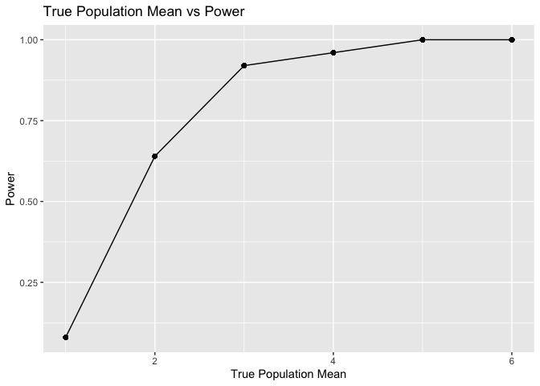
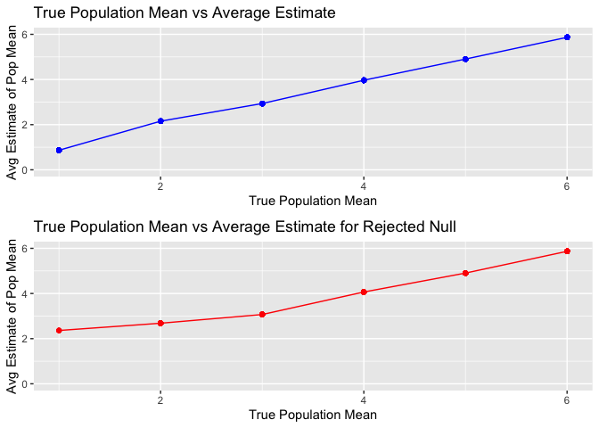

p8105_hw5_enp2116
================
Emily Potts
2022-11-13

# Problem 1

-   Starting with a dataframe containing all file names, iterating over
    file names and reading in data for each subject. using purrr::map
    and saving the result as a new variable in the dataframe

``` r
full_df = 
  tibble(
    files = list.files("data/zip_data/"),
    path = str_c("data/zip_data/", files)
  ) %>% 
  mutate(data = map(path, read_csv)) %>% 
  unnest(cols = c(data))
```

-   Tidying the dataframe: manipulating file names to include control
    arm and subject ID, make sure weekly observations are tidy, and
    making sure variables are the correct type.

``` r
tidy_df = 
  full_df %>% 
  mutate(
    files = str_replace(files, ".csv", ""),
    group = str_sub(files, 1, 3)) %>% 
  pivot_longer(
    week_1:week_8,
    names_to = "week",
    values_to = "outcome",
    names_prefix = "week_") %>% 
  mutate(week = as.numeric(week)) %>% 
  select(group, subj = files, week, outcome)
```

Making a spaghetti plot to show observations on each subject over time:

``` r
tidy_df %>% 
  ggplot(aes(x = week, y = outcome, group = subj, color = group)) + 
  geom_point() + 
  geom_path() + xlab("Week") + ylab("Outcome") + 
  labs(title = "Observations Over Time by Subject") + facet_grid(~group)
```

<!-- -->

Comment on differences between groups:

The side-by-side spaghetti plots show differences between the control
and experimental groups. While both groups start off around the same
level of outcome (experimental slightly higher), the control group is
stable over time. In contrast, the experimental group increases
relatively linearly over the time of the study. Finally, we see high
within-subject correlation, where subjects who start above average end
up above average, and those that start below average end up below
average.

# Problem 2

-   Describe the raw data.

``` r
raw_homicide_df =
  read_csv("data/homicide-data.csv")
```

    ## Rows: 52179 Columns: 12
    ## ── Column specification ────────────────────────────────────────────────────────
    ## Delimiter: ","
    ## chr (9): uid, victim_last, victim_first, victim_race, victim_age, victim_sex...
    ## dbl (3): reported_date, lat, lon
    ## 
    ## ℹ Use `spec()` to retrieve the full column specification for this data.
    ## ℹ Specify the column types or set `show_col_types = FALSE` to quiet this message.

The raw homicide data includes information on the victims (first name,
last name, race, age, sex), information on the report (ID, date
reported), information on the location of the homicide (city, state,
latitude, longitude), and the outcome of the investigation
(disposition).

-   Create a city_state variable (e.g. “Baltimore, MD”) and then
    summarize within cities to obtain the total number of homicides and
    the number of unsolved homicides (those for which the disposition is
    “Closed without arrest” or “Open/No arrest”).

``` r
tidy_homicide = 
  raw_homicide_df %>% 
  mutate(city_state = paste(city, state, sep = ", "),
         outcome = case_when(disposition == "Closed without arrest" ~ 'unsolved',
                               disposition == "Open/No arrest" ~ 'unsolved',
                               disposition == "Closed by arrest" ~ 'solved'))

tidy_homicide %>% 
  group_by(city_state) %>% 
  summarize(
    total_n = n(),
    unsolved_n = sum(outcome == "unsolved")
  )
```

    ## # A tibble: 51 × 3
    ##    city_state      total_n unsolved_n
    ##    <chr>             <int>      <int>
    ##  1 Albuquerque, NM     378        146
    ##  2 Atlanta, GA         973        373
    ##  3 Baltimore, MD      2827       1825
    ##  4 Baton Rouge, LA     424        196
    ##  5 Birmingham, AL      800        347
    ##  6 Boston, MA          614        310
    ##  7 Buffalo, NY         521        319
    ##  8 Charlotte, NC       687        206
    ##  9 Chicago, IL        5535       4073
    ## 10 Cincinnati, OH      694        309
    ## # … with 41 more rows

-   For the city of Baltimore, MD, use the prop.test function to
    estimate the proportion of homicides that are unsolved; save the
    output of prop.test as an R object, apply the broom::tidy to this
    object and pull the estimated proportion and confidence intervals
    from the resulting tidy dataframe.

-   Now run prop.test for each of the cities in your dataset, and
    extract both the proportion of unsolved homicides and the confidence
    interval for each. Do this within a “tidy” pipeline, making use of
    purrr::map, purrr::map2, list columns and unnest as necessary to
    create a tidy dataframe with estimated proportions and CIs for each
    city.

Create a plot that shows the estimates and CIs for each city – check out
geom_errorbar for a way to add error bars based on the upper and lower
limits. Organize cities according to the proportion of unsolved
homicides.

# Problem 3

Fixing $n = 30, \sigma = 5$, setting $\mu = 0$ and generating 5000
datasets from the model. For each dataset, we save $\hat{\mu}$ and the
p-value arising from a test of if $\mu = 0$ for $\alpha = 0.05$.

``` r
sim_mean_sd = function(n_obs = 30, mu, sigma = 5) {
  
  sim_data = tibble(
    x = rnorm(n = n_obs, mu, sd = sigma),
  )
  
  sim_data %>% 
    summarize(
      mu_hat = mean(x),
      p_value = (broom::tidy(t.test(x, mu = 0, conf.level = 0.95))$p.value)
    )
}
```

Repeating the above for $\mu={1,2,3,4,5,6}$:

``` r
sim_results_df = 
  expand_grid(
    mu_list = c(1,2,3,4,5,6),
    iter = 1:50
  ) %>% 
  mutate(
    estimate_df = map(.x = mu_list, ~ sim_mean_sd(mu = .x))
  ) %>% 
  unnest(estimate_df)
sim_results_df
```

    ## # A tibble: 300 × 4
    ##    mu_list  iter  mu_hat   p_value
    ##      <dbl> <int>   <dbl>     <dbl>
    ##  1       1     1  3.44   0.0000652
    ##  2       1     2  0.817  0.351    
    ##  3       1     3  0.0583 0.940    
    ##  4       1     4  1.33   0.142    
    ##  5       1     5  0.651  0.501    
    ##  6       1     6  0.267  0.789    
    ##  7       1     7  0.878  0.382    
    ##  8       1     8  0.951  0.217    
    ##  9       1     9  1.37   0.109    
    ## 10       1    10 -0.151  0.875    
    ## # … with 290 more rows

-   Make a plot showing the proportion of times the null was rejected
    (the power of the test) on the y axis and the true value of $\mu$ on
    the x axis. Describe the association between effect size and power.
    <!-- -->
    From the plot of true population mean versus power, we can see that
    at a true $\mu$ of 1, the power of the test is quite low. However,
    as $\mu$ increases, the power increases at an decreasing rate as it
    approaches 1. Generalizing this relationship from our example, we
    can see that as effect size increases from the null (which is
    $\mu = 0$ here), we have greater power to detect a true difference
    and at a high enough effect size, the tests will be almost perfect
    at doing so.

-   First, making a plot showing the average estimate of $\hat{\mu}$ on
    the y axis and the true value of $\mu$ on the x axis. Second, making
    a second plot of the average estimate of $\hat{\mu}$ only in samples
    for which the null was rejected on the y axis and the true value of
    $\mu$ on the x axis.

<!-- -->
The sample average of $\hat{\mu}$ across tests for which the null is
rejected approximately equal to the true value of $\mu$ at $\mu \geq 3$.
At $\mu = 1$, we see a large discrepancy between the average estimates,
with the rejected estimate over 2 and the total at about 1. The
discrepancy gets smaller at $\mu = 2$, with the rejected estimate at
about 2.5 and the total at about 2. This is because after the effect
size gets large enough, the test will nearly always reject the null. At
smaller values of $\mu$, where rejection occurs more often because
values are closer to $\mu_0 = 0$, the rejected $\hat{\mu}$s are larger
on average.
