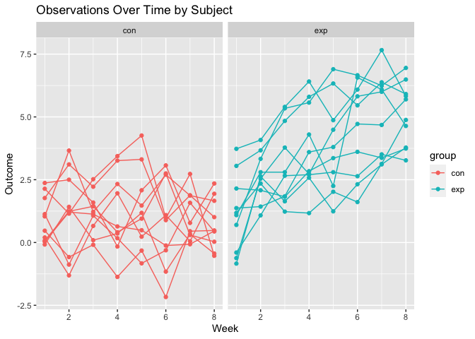
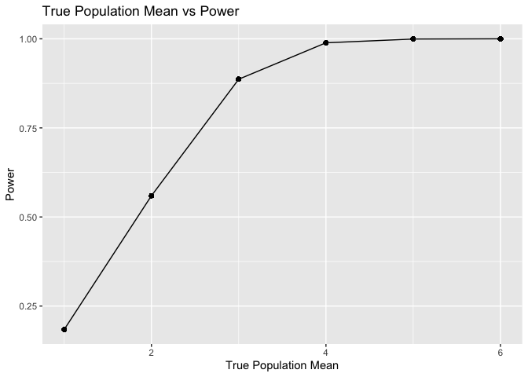

p8105_hw5_enp2116
================
Emily Potts
2022-11-13

# Problem 1

-   Starting with a dataframe containing all file names, iterating over
    file names and reading in data for each subject, using purrr::map
    and saving the result as a new variable in the dataframe:

``` r
all_files_df = 
  tibble(
    files = list.files("data/zip_data/"),
    path = str_c("data/zip_data/", files)
  ) %>% 
  mutate(data = purrr::map(path, read_csv)) %>% 
  unnest(cols = c(data))
head(all_files_df)
```

    ## # A tibble: 6 × 10
    ##   files      path        week_1 week_2 week_3 week_4 week_5 week_6 week_7 week_8
    ##   <chr>      <chr>        <dbl>  <dbl>  <dbl>  <dbl>  <dbl>  <dbl>  <dbl>  <dbl>
    ## 1 con_01.csv data/zip_d…   0.2   -1.31   0.66   1.96   0.23   1.09   0.05   1.94
    ## 2 con_02.csv data/zip_d…   1.13  -0.88   1.07   0.17  -0.83  -0.31   1.58   0.44
    ## 3 con_03.csv data/zip_d…   1.77   3.11   2.22   3.26   3.31   0.89   1.88   1.01
    ## 4 con_04.csv data/zip_d…   1.04   3.66   1.22   2.33   1.47   2.7    1.87   1.66
    ## 5 con_05.csv data/zip_d…   0.47  -0.58  -0.09  -1.37  -0.32  -2.17   0.45   0.48
    ## 6 con_06.csv data/zip_d…   2.37   2.5    1.59  -0.16   2.08   3.07   0.78   2.35

-   Tidying the dataframe: manipulating file names to include control
    arm and subject ID, make sure weekly observations are tidy, and
    making sure variables are the correct type.

``` r
tidy_df = 
  all_files_df %>% 
  mutate(
    files = str_replace(files, ".csv", ""),
    group = str_sub(files, 1, 3)) %>% 
  pivot_longer(
    week_1:week_8,
    names_to = "week",
    values_to = "outcome",
    names_prefix = "week_") %>% 
  mutate(week = as.numeric(week)) %>% 
  select(group, subj = files, week, outcome)
head(tidy_df)
```

    ## # A tibble: 6 × 4
    ##   group subj    week outcome
    ##   <chr> <chr>  <dbl>   <dbl>
    ## 1 con   con_01     1    0.2 
    ## 2 con   con_01     2   -1.31
    ## 3 con   con_01     3    0.66
    ## 4 con   con_01     4    1.96
    ## 5 con   con_01     5    0.23
    ## 6 con   con_01     6    1.09

-   Making a spaghetti plot using ggplot to show observations on each
    subject over time:
    <!-- -->

-   Differences between groups:

The side-by-side spaghetti plots show differences between the control
and experimental groups. While both groups start off around the same
level of outcome (experimental slightly higher), the control group is
stable over time. In contrast, the experimental group increases
relatively linearly over the time of the study. Finally, we see high
within-subject correlation, where subjects who start above average end
up above average, and those that start below average end up below
average.

# Problem 2

-   The raw homicide data includes information on the victims (first
    name, last name, race, age, sex), information on the report (ID,
    date reported), information on the location of the homicide (city,
    state, latitude, longitude), and the outcome of the investigation
    (disposition). There are 52179 rows, which means we have data on
    52179 different homicides across the United States. We have a
    variable of interest disposition, which takes on the values ofClosed
    without arrest, Closed by arrest, Open/No arrest.

-   Creating a city_state variable and summarizing within cities to
    obtain the total number of homicides and the number of unsolved
    homicides:

``` r
tidy_homicide = 
  raw_homicide_df %>% 
  mutate(
    city_state = paste(city, state, sep = ", "),
    city_state = ifelse(city_state == "Tulsa, AL", "Tulsa, OK", city_state),
    outcome = case_when(disposition == "Closed without arrest" ~ 'unsolved',
                        disposition == "Open/No arrest" ~ 'unsolved',
                        disposition == "Closed by arrest" ~ 'solved')) %>% 
  group_by(city_state) %>% 
  summarize(
    unsolved_n = sum(outcome == "unsolved"),
    total_n = n()
  ) 
head(tidy_homicide)
```

    ## # A tibble: 6 × 3
    ##   city_state      unsolved_n total_n
    ##   <chr>                <int>   <int>
    ## 1 Albuquerque, NM        146     378
    ## 2 Atlanta, GA            373     973
    ## 3 Baltimore, MD         1825    2827
    ## 4 Baton Rouge, LA        196     424
    ## 5 Birmingham, AL         347     800
    ## 6 Boston, MA             310     614

-   For the city of Baltimore, MD, using the prop.test function to
    estimate the proportion of homicides that are unsolved; saving the
    output of prop.test as an R object, applying the broom::tidy to this
    object and pulling the estimated proportion and confidence intervals
    from the resulting tidy dataframe:

``` r
x = tidy_homicide %>% 
  filter(city_state == "Baltimore, MD") %>% 
  pull(unsolved_n)

n = tidy_homicide %>% 
  filter(city_state == "Baltimore, MD") %>% 
  pull(total_n)

prop.test(x, n) %>% 
  broom::tidy() %>% 
  select(estimate, starts_with("conf"))
```

    ## # A tibble: 1 × 3
    ##   estimate conf.low conf.high
    ##      <dbl>    <dbl>     <dbl>
    ## 1    0.646    0.628     0.663

-   Running prop.test for each of the cities in your dataset, and
    extracting both the proportion of unsolved homicides and the
    confidence interval for each:

``` r
homicide_prop_tests = 
  tidy_homicide %>% 
  group_by(city_state) %>% 
  mutate(
    h_prop_test = map2(unsolved_n, total_n, ~prop.test(.x, .y) %>% broom::tidy())) %>% 
      unnest(h_prop_test) %>% 
      select(city_state, estimate, conf.low, conf.high)
head(homicide_prop_tests)  
```

    ## # A tibble: 6 × 4
    ## # Groups:   city_state [6]
    ##   city_state      estimate conf.low conf.high
    ##   <chr>              <dbl>    <dbl>     <dbl>
    ## 1 Albuquerque, NM    0.386    0.337     0.438
    ## 2 Atlanta, GA        0.383    0.353     0.415
    ## 3 Baltimore, MD      0.646    0.628     0.663
    ## 4 Baton Rouge, LA    0.462    0.414     0.511
    ## 5 Birmingham, AL     0.434    0.399     0.469
    ## 6 Boston, MA         0.505    0.465     0.545

-   Creating a plot that shows the estimates and CIs for each city using
    geom_errorbar for a way to add error bars based on the upper and
    lower limits
    <!-- -->

# Problem 3

Fixing $n = 30, \sigma = 5$, setting $\mu = 0$ and generating 5000
datasets from the model. For each dataset, we save $\hat{\mu}$ and the
p-value arising from a test of if $\mu = 0$ for $\alpha = 0.05$.

``` r
sim_mu = function(n_obs = 30, mu, sigma = 5) {
  
  sim_data = tibble(
    x = rnorm(n = n_obs, mu, sd = sigma),
  )
  
  sim_data %>% 
    summarize(
      mu_hat = mean(x),
      p_value = (broom::tidy(t.test(x, mu = 0, conf.level = 0.95))$p.value)
    )
}

sim_mu_zero = 
  expand_grid(
    mu_value = 0,
    iter = 1:5000
  ) %>% 
  mutate(
    estimate_df = map(.x = mu_value, ~ sim_mu(mu = .x))
  ) %>% 
  unnest(estimate_df)
head(sim_mu_zero)
```

    ## # A tibble: 6 × 4
    ##   mu_value  iter mu_hat p_value
    ##      <dbl> <int>  <dbl>   <dbl>
    ## 1        0     1  2.44  0.00254
    ## 2        0     2 -0.183 0.834  
    ## 3        0     3 -0.942 0.231  
    ## 4        0     4  0.327 0.712  
    ## 5        0     5 -0.349 0.718  
    ## 6        0     6 -0.733 0.464

Repeating the above for $\mu={1,2,3,4,5,6}$:

``` r
sim_results_df = 
  expand_grid(
    mu_list = c(1,2,3,4,5,6),
    iter = 1:5000
  ) %>% 
  mutate(
    estimate_df = map(.x = mu_list, ~ sim_mu(mu = .x))
  ) %>% 
  unnest(estimate_df)
sim_results_df
```

    ## # A tibble: 30,000 × 4
    ##    mu_list  iter  mu_hat p_value
    ##      <dbl> <int>   <dbl>   <dbl>
    ##  1       1     1 -0.380   0.751 
    ##  2       1     2  0.518   0.695 
    ##  3       1     3  0.808   0.321 
    ##  4       1     4  0.952   0.260 
    ##  5       1     5  0.187   0.846 
    ##  6       1     6  1.76    0.0646
    ##  7       1     7  1.58    0.0316
    ##  8       1     8  0.752   0.452 
    ##  9       1     9  0.0375  0.966 
    ## 10       1    10  1.79    0.0325
    ## # … with 29,990 more rows

-   Make a plot showing the proportion of times the null was rejected
    (the power of the test) on the y axis and the true value of $\mu$ on
    the x axis. Describe the association between effect size and power.
    <!-- -->
    From the plot of true population mean versus power, we can see that
    at a true $\mu$ of 1, the power of the test is quite low. However,
    as $\mu$ increases, the power increases at an decreasing rate as it
    approaches 1. Generalizing this relationship from our example, we
    can see that as effect size increases from the null (which is
    $\mu = 0$ here), we have greater power to detect a true difference
    and at a high enough effect size, the tests will be almost perfect
    at doing so.

-   Making a plot showing the average estimate of $\hat{\mu}$ on the y
    axis and the true value of $\mu$ on the x axis. Second, making a
    second plot of the average estimate of $\hat{\mu}$ only in samples
    for which the null was rejected on the y axis and the true value of
    $\mu$ on the x axis.
    <!-- -->
    The sample average of $\hat{\mu}$ across tests for which the null is
    rejected approximately equal to the true value of $\mu$ at
    $\mu \geq 3$. At $\mu = 1$, we see a large discrepancy between the
    average estimates, with the rejected estimate over 2 and the total
    at about 1. The discrepancy gets smaller at $\mu = 2$, with the
    rejected estimate at about 2.5 and the total at about 2. This is
    because after the effect size gets large enough, the test will
    nearly always reject the null. At smaller values of $\mu$, where
    rejection occurs more often because values are closer to
    $\mu_0 = 0$, the rejected $\hat{\mu}$s are larger on average.
